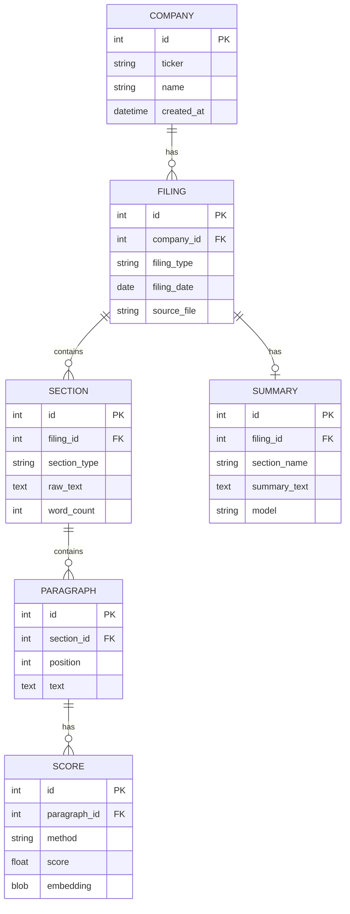

# Infera Architecture

## System Overview

---

## Data Flow

---

## Component Details

### Ingest Layer

| Component | File | Purpose |
|-----------|------|---------|
| SEC Fetcher | `ingest/sec_fetcher.py` | Rate-limited 10-K download from EDGAR |
| Cleaner | `analyze/cleaner.py` | HTML → clean text (BeautifulSoup) |
| Segmenter | `analyze/segmenter.py` | Extract Item 1A (Risk Factors) |

### ML Layer

| Component | File | Model | Purpose |
|-----------|------|-------|---------|
| Scoring | `services/scoring_service.py` | FinBERT | Cosine similarity scoring |
| Attribution | `services/attribution_service.py` | FinBERT | Token-level explainability |
| Classification | `services/classification_service.py` | FinBERT | 8-category risk taxonomy |

### LLM Layer

| Component | File | Model | Purpose |
|-----------|------|-------|---------|
| Summarizer | `analyze/summarizer.py` | GPT-4o | Executive summaries |
| Structured | `analyze/structured_summarizer.py` | GPT-4o | Pydantic-validated JSON |
| Production | `analyze/production_summarizer.py` | GPT-4o | Retry + fallback |

### API Layer

| Endpoint | Method | Purpose |
|----------|--------|---------|
| `/fetch` | POST | Fetch 10-K from SEC EDGAR |
| `/analyze` | POST | Run analysis on local file |
| `/filings` | GET | List analyzed filings |
| `/filings/{id}` | GET | Get filing details |
| `/search` | GET | Semantic search |
| `/benchmark` | GET | Peer comparison |
| `/explain/{id}` | GET | Token attribution |
| `/paragraphs/{id}` | GET | Paragraph with embedding |

### Agent Integration

| Component | File | Framework |
|-----------|------|-----------|
| Python SDK | `sdk/infera_client.py` | httpx |
| LangGraph | `examples/langgraph_tool.py` | langgraph |
| OpenAI Functions | `examples/openai_functions.py` | JSON Schema |

---

## Database Schema

---

## Embedding Flow

---

## Deployment Options

---

*Last updated: January 2026*

