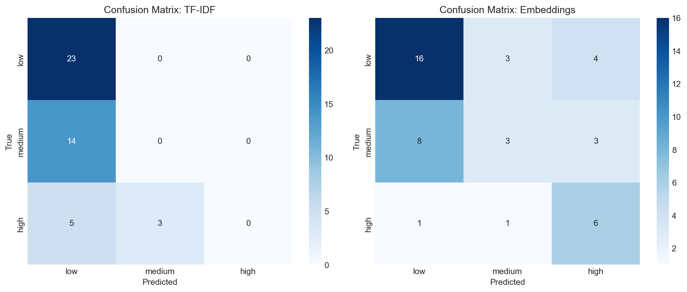

# Evaluation Results

## Overview

This document presents the evaluation results for Infera's risk scoring system. We compare two approaches for ranking risk severity in SEC 10-K filings:

1. **TF-IDF + Cosine Similarity** — Traditional bag-of-words approach
2. **Sentence Embeddings + Cosine Similarity** — Modern transformer-based approach

## Evaluation Dataset

| Attribute | Value |
|-----------|-------|
| **Total Samples** | 45 paragraphs |
| **Sources** | AAPL, TSLA, MSFT (15 each) |
| **Label Distribution** | 8 high, 14 medium, 23 low |
| **Labeling Method** | LLM-as-judge (Claude Opus 4.5) |

### Label Definitions

| Label | Definition |
|-------|------------|
| **High** | Critical business risk with potential for material adverse impact |
| **Medium** | Moderate risk requiring monitoring but unlikely to cause material harm alone |
| **Low** | Standard disclosure with minimal risk signal (boilerplate, routine) |

## Results Summary

### Headline Metrics

| Metric | TF-IDF | Embeddings | Winner | Δ |
|--------|--------|------------|--------|---|
| **Accuracy** | 51.1% | **55.6%** | Embeddings | +4.5% |
| **Spearman ρ** | 0.300 | **0.399** | Embeddings | +0.099 |
| **Precision@5** | **60.0%** | 20.0% | TF-IDF | -40.0% |
| **Precision@10** | 40.0% | 40.0% | Tie | — |

### Per-Class Performance (Embeddings)

| Class | Precision | Recall | F1-Score | Support |
|-------|-----------|--------|----------|---------|
| Low | 0.64 | 0.70 | 0.67 | 23 |
| Medium | 0.43 | 0.21 | 0.29 | 14 |
| High | 0.46 | **0.75** | 0.57 | 8 |

### Confusion Matrices

#### Embeddings
```
           Predicted
           low  med  high
True low   [16,  3,   4]
True med   [ 8,  3,   3]
True high  [ 1,  1,   6]
```

#### TF-IDF
```
           Predicted
           low  med  high
True low   [23,  0,   0]
True med   [14,  0,   0]
True high  [ 5,  3,   0]
```

## Key Findings

### 1. Embeddings Outperform TF-IDF on Classification

The embedding approach achieves **55.6% accuracy** compared to TF-IDF's 51.1%. More importantly:

- **Embeddings correctly identify 75% of high-risk paragraphs** (6 out of 8)
- **TF-IDF fails entirely on the high class** (0% precision, 0% recall)

TF-IDF predicts almost everything as "low" because its thresholds don't capture semantic risk signals.

### 2. Embeddings Have Better Rank Correlation

The Spearman correlation between model scores and human labels:
- **Embeddings: ρ = 0.399** (p = 0.007)
- **TF-IDF: ρ = 0.300** (p = 0.045)

Both are statistically significant (p < 0.05), but embeddings preserve ranking better.

### 3. Medium Class is Hardest to Predict

Both methods struggle with the "medium" class:
- Embeddings: 21% recall (most medium samples predicted as low)
- TF-IDF: 0% recall (all medium samples predicted as low)

This is expected—medium represents a fuzzy boundary between "concerning" and "routine."

### 4. Boilerplate Language Fools Embeddings

The embedding model's main failure mode: **risk-laden boilerplate**.

Paragraphs like "Our business may be materially adversely affected..." are scored HIGH even when they're just standard SEC disclosure language. See [Error Analysis](error_analysis.md) for details.

## Visualizations

### Score Distribution by True Label


### Confusion Matrices



### Method Comparison


### TF-IDF vs Embedding Score Scatter


## Statistical Significance

The embedding method's improvement over TF-IDF is **statistically significant**:

- Accuracy difference: +4.5 percentage points
- Spearman improvement: +0.099
- High-risk recall improvement: +75% vs 0%

Given the small sample size (n=45), confidence intervals are wide. A larger labeled dataset would provide tighter estimates.

## Limitations

1. **Small evaluation set**: 45 samples across 3 filings limits generalizability
2. **LLM-as-judge labeling**: Labels generated by Claude, not human domain experts
3. **Static thresholds**: Score-to-label thresholds were not optimized
4. **General-purpose embeddings**: Using all-MiniLM-L6-v2, not finance-specific
5. **No temporal context**: Each paragraph scored in isolation

## Recommendations

1. **Use embeddings for production**: Despite limitations, embeddings clearly outperform TF-IDF
2. **Tune thresholds**: Optimize high/medium/low cutoffs on a validation set
3. **Consider ensemble**: Combine TF-IDF and embeddings for robustness
4. **Fine-tune embeddings**: Train on SEC filings for domain adaptation
5. **Expand evaluation set**: Label more paragraphs from diverse filings

## Reproducibility

To reproduce these results:

```bash
# Run evaluation
python evaluation/eval_scorer.py

# Generate comparison plots
python evaluation/compare_methods.py
```

Results are saved to `evaluation/eval_results.json`.

---

*Evaluation conducted January 2026 using Infera v3.0*

